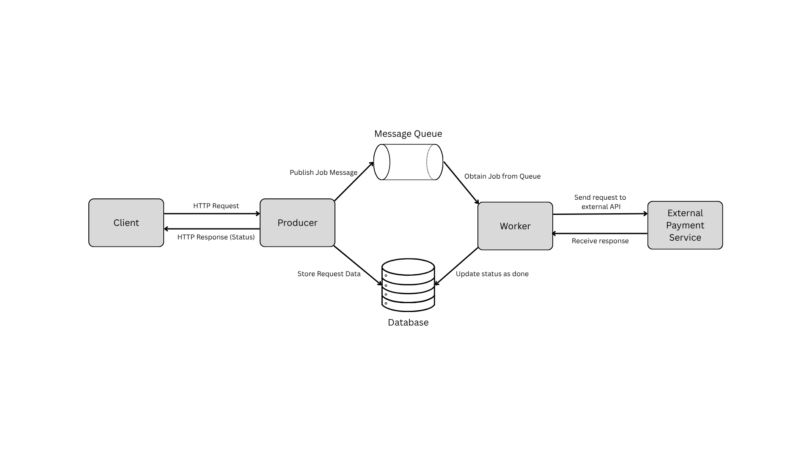
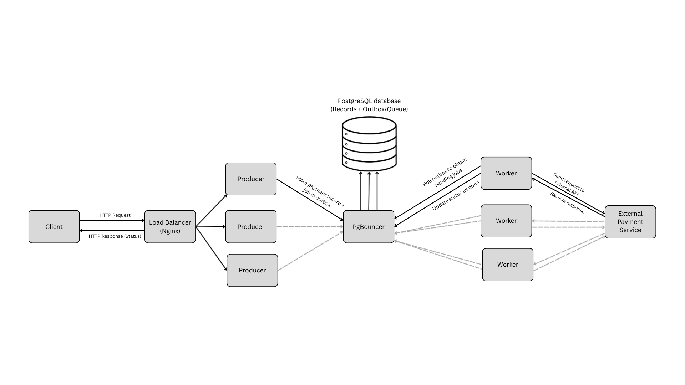
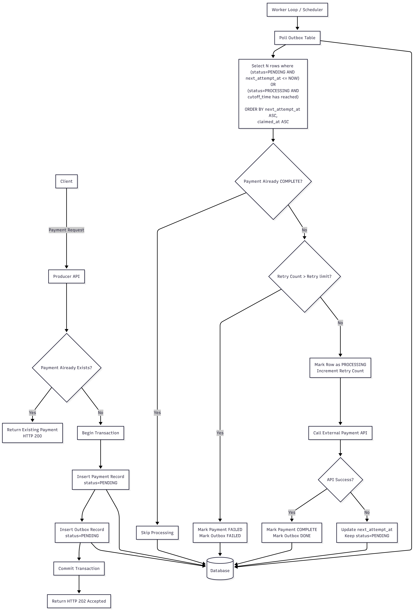

# Payment Processsing Application (Take Home Assignment)

This is my solution for the take home assignment to implement a fault tolerant payment processing application with horizontal scaling capabilities. The system accepts payment API requests, persists them durably, and processes the external payment submission asynchronously using worker(s). It supports single-instance and scaled deployments and provides performance and crash-recovery tests.

## Table of Contents

- [Overview](#overview)
- [Architecture and Design Choices](#architecture)
- [Assumptions and Tradeoffs](#assumptions-and-tradeoffs)
- [Reliability and Restart Behavior](#reliability-and-restart-behavior)
- [AI Tools Usage](#aitools)
- [Project Structure](#project-structure)
- [Run the Application](#run-the-application)
- [Run Tests](#run-tests)
- [Observability and Metrics](#observability-and-metrics)

## Overview

The core flow is:

1. A client calls `POST /payments` to submit a payment request.
2. The system persists a `payments` row and matching `outbox` row in one database transaction.
3. Worker(s) poll and claim outbox rows using row-level locking (`FOR UPDATE SKIP LOCKED`).
4. Worker(s) call the external payment simulator.
5. Worker(s) update payment/outbox statuses to terminal states (`completed`/`done` or `failed`).

## Architecture and Design Choices

### Architecture

The system is designed in a producer-worker architecture to allow decoupling of providing client responses and processing the payments. The producer consists of an API endpoint which listens and accepts payment requests, adds them to a database, and also in an outbox/queue. The worker is responsible for processing entries from this queue by claiming payment jobs, calling the external payment API and setting them as completed or failed (if the retry limit has been reached) after the response.



By decoupling the producer and the worker, both of them can be scaled independently.

### Technology Stack Choices

- Java and Springboot has been used for implementing the main application (producer, worker, payment simulator). This choice was made because it was given as the preferred choice in the assignment instructions. I also lack prior experience with the language and framework because my expereince in backend systems has mostly involved Python/Flask and Node/JS, and I therefore wanted to become familiar with them through this assignment.
- PostgreSQL is used as the database system. Because of the structured nature of the payment records, a relational model would be suitable for storing the records compared to NoSQL databases.
- The system uses the concept of a queue and although it was initially designed to use a separate message queue technology, I ultimately decided to implement the queue as an outbox table in the PostgreSQL database itself in order to keep the system simpler and reduce overhead. The producer and worker both already interact with the database to update the status of the payment records, so using the same database for the outbox and the payment records table avoids the need to introduce another external subpart which would increase overhead and would need to be kept aligned in case of crashes or failures. The system's use case is simple enough to work well using this simplified version of the architecture, and workers can directly poll the outbox for pending jobs and update their status.
- The above point further solidified the justification to use PostgreSQL because it has convenient features for atomic multi-row transactions and safe concurrent worker claiming using row locking.
- PgBouncer is used in the horizontally scaled version of the system because as the app scales horizontally, each producer and worker instance requires its own PostgreSQL connection pool. Using PgBouncer helped to reduce connection overhead and protect the database from connection exhaustion.
- To provide a single and stable API endpoint in the case of multiple producers, Nginx is used as the reverse proxy to distribute the requests across producer instances. Nginx is a standard choice for load balancers to distribute load across HTTP endpoints, and by default it uses round robin to spread traffic evenly between the servers.
- Docker compose was used to package the services into containers with their proper configuartions and provide an easy way to run them together. It was also used to run scaled versions of the system and to run multiple insatnces of the producer and worker easily.



### Data Path

The following flowchart explains the end-to-end path of a payment from when a client submits the request, upto its completion.



### Data model (high level)

`payments` table stores business state and external call outcome:

- `id`, `idempotency_key`
- `status` (received/processing/completed/failed)
- `attempt_count`, `last_attempted_at`
- `external_response`, `failure_reason`

`outbox` table stores delivery work items:

- `id`, `payment_id`
- `status` (pending/processing/done/failed)
- `attempt_count`
- `next_attempt_at`
- `claimed_by`, `claimed_at`

### Concurrency model

Workers claim rows with SQL similar to:

```sql
SELECT *
FROM outbox
WHERE (status = 'pending' AND next_attempt_at <= now())
   OR (status = 'processing' AND claimed_at <= :processing_cutoff)
ORDER BY next_attempt_at NULLS FIRST, claimed_at NULLS FIRST
LIMIT :limit
FOR UPDATE SKIP LOCKED;
```

This allows multiple workers to process without double-claiming the same row.

### Retry/backoff model

Retry behavior is configurable in `service/src/main/resources/application.yml`:

- Base delay: 200ms
- Multiplier: 2.0
- Jitter: 0.5 to 1.0
- Max attempts: 5

Failed calls return the outbox row to `pending` and set `next_attempt_at` using exponential backoff + jitter.

## Assumptions and Tradeoffs

- The system uses a decoupling architecture to separate the producer and worker. Doing this allows the system to become more fault tolerant and to scale the producer and worker independently. The tradeoff is that this adds implemenation outbox complexity compared to direct synchronous external calls.
- The implemenation uses a simpler design for the outbox/queue instead of a separate queue broker. This reduces the overhead of aligning the database with another external service entering the system (this can be easily done by transactions if the outbox queue is a part of the database, but it becomes more difficult for two different systems), but the tradeoff is that it increases the load on the database versus using dedicated message brokers. It is assumed that the performance is reasonable for this use case but at very high scale, throughput may require tighter DB tuning and partitioning strategies.
- Although the producer and worker both have scaling capabilities, scaling the producer is not assumed to be the priority because producers handle relatively low processing overhead when serving client requests. The API's saturation point is around 5000 requests/s, and this is assumed to be a sufficient for the use case. Adding more producers could be counterintuitive because it can exhuast the DB's connection pool. Given the scenario of this assignment, the payment service is the main bottleneck of the workflow, as the responses are obtained with a random delay of 10ms-2s. Therefore it is beneficial to scale up the workers to increase the system's throughout, and it is assumed that this is the main target of horizontal scaling. More information about the performance of producer vs worker scaling can be found in the performance report.
- The external payment API is assumed to support the use of idempotency keys to prevent re-processing of the same payment twice. It is also assumed that the client application generates these keys and sends them as a part of the API request, because the logic of creating an idempotency key should be handled by the client to properly distinguish between a retried payment request and a genuinely new payment with identical data. Nonetheless, to simplify the simulation of client requests for this assignment, the producer implementation first checks whether an idempotency key is present in the request. If no key is provided, the producer generates one by hashing selected fields from the payment request.

## Reliability and Restart Behavior

The following points support the durability and reliability of the system.

### Durability guarantees

- Once a producer obtains a client request, it creates the payment and outbox records in the same DB transaction. This ensure that both of the tables remain in sync and in case the producer crashes between creating both entries, the system rolls back the change and sends an error status code to the client.
- If the producer crashes after commiting to the database and sending an OK status to the client, the payment and outbox record remains and can still be processed by workers.
- If the producer crashes after commiting to the database but before sending an OK status to the client, then once the client re-sends the request it will simply return the already present payment request in the database without creating a new one. This also ensures that a payment request from a client will enter only once into the database.

### Worker crash behavior

- Once a worker claims rows in the outbox table, it marks them as `processing`, along with `claimed_by` and `claimed_at` to add metadata about the process and the time of when it was claimed.
- If a worker crashes mid-flight, these rows remain in DB.
- Other worker(s) can reclaim these stale `processing` rows once a lease timeout is exceeded. (Default lease timeout is configured as `payment.worker.lease-timeout-ms`). `FOR UPDATE SKIP LOCKED` prevents duplicate concurrent claims from multiple workers but this lock is removed when the timeout is exceeded.
- This ensures that upon a worker experiencing failure/crashing, the payments in the outbox which were claimed by the failure worker are eventually processed by some worker (either the same one once it has restarted, or by other workers).

### Idempotency model

- Requests can include `Idempotency-Key` header. If missing, a deterministic key is generated from request payload.
- The payment API is assumed to work in a way that an existing key returns the existing payment resource (no duplicate logical payment). Although no duplicate requests are obtained by the client in the database, the idempotency key logic is crucial because it ensures that if a worker sucessfully calls the external API and crashes before it set the outbox record as `done`, the payment will not be made twice when the row is picked up again after the lease timeout is exceeded. Upon making the external call twice, the row will safely be set as completed without duplication of payment. Therefore this design provides at-least-once delivery to external processing attempts.

## AI Tools Usage

After initial planning of the architecture and technologies for the system, I used Spec Kit to formally structure my design choices into system specifications, plans and then tasks. I also used the implement feature of Spec Kit to implement the primary source code for the application. Given that this was the first application that I built using Java and Springboot, using Spec Kit was quite beneficial in translating my system level designs into progamming language specifics. I used both Copilot and manual code refactoring/editing when required for fixing bugs and implemenation issues.

## Project Structure

```text
requests/           # REST request samples
service/            # Spring Boot service, Docker compose, migrations, tests, perf scripts
specs/              # Feature specs, plans, tasks, contracts, research docs
```

## Run the Application

### Prerequisites

- Java 17
- Maven 3.9+
- Docker + Docker Compose
- For shell-based perf scripts: `k6`, `psql`, `bash`

### Option A: Docker single-instance (recommended quick start)

From `service/`:

```bash
docker compose -f docker-compose.yml up
```

Endpoints:

- API: http://localhost:8080
- Simulator: http://localhost:8081

Stop:

```bash
docker compose -f docker-compose.yml down
```

### Option B: Docker scaled mode (producer/worker split)

From `service/`:

```bash
docker compose -f docker-compose.scale.yml up --scale producer=N --scale worker=M
```
Example startup with 2 producers and 5 workers:

```bash
docker compose -f docker-compose.scale.yml up --scale producer=2 --scale worker=5
```
Note: recommended setup is a single producer with single/multiple workers.

```bash
docker compose -f docker-compose.scale.yml up --scale worker=10
```

Endpoints:

- Load-balanced API: http://localhost:80
- Simulator: http://localhost:8081
- PgBouncer: localhost:6432

Stop:

```bash
docker compose -f docker-compose.scale.yml down
```

### Option C: Local process run (without full Docker stack)

1. Start DB:

```bash
docker compose -f service/docker-compose.yml up -d postgres
```

2. Start simulator:

```bash
cd service
mvn -q spring-boot:run -Dspring-boot.run.arguments="--spring.profiles.active=simulator --server.port=8081"
```

3. Build and run app:

```bash
cd service
mvn clean package
java -jar target/paymentapp-0.1.0-SNAPSHOT.jar --spring.profiles.active=local --server.port=8080
```
Note: Additional documentation for running the application is in `service/README.md`.

## Run Tests

More detailed information for the performance tests and crash recovery tests (subheadings 2, 3 and 4 in this section) can be found in `service/perf/README.md` and `service/perf/CRASH_RECOVERY_TESTS.md`.

### 1) Unit + integration tests (Maven)

From `service/`:

```bash
mvn verify
```

This runs Spring Boot tests and integration coverage checks configured in Maven.

### 2) Producer performance tests (k6)

Start test stack from `service/`:

For single instance: 

```bash
docker compose -f docker-compose.test.yml up
```
Then run:

```bash
k6 run perf/k6-single.js
```

For multi instance:

```bash
docker compose -f docker-compose.scale.test.yml up --scale producer=N --scale worker=M
```

Then run:

```bash
k6 run perf/k6-multi.js
```

Optional overrides:

```bash
VUS=200 DURATION=120s API_BASE_URL=http://localhost:8080 k6 run perf/k6-single.js
```

### 3) Worker/outbox performance test

First start test stack from `service/` for a single or multi instance by running either:

```bash
docker compose -f docker-compose.test.yml up
docker compose -f docker-compose.scale.test.yml up --scale producer=N --scale worker=M
```
Then from `service/`:

```bash
./perf/run-worker-metrics.sh
```

Example parameterization:

```bash
WORKER_BACKLOG_SIZE=500 WORKER_POLL_INTERVAL_SECONDS=1 WORKER_MAX_WAIT_SECONDS=600 ./perf/run-worker-metrics.sh
```

### 4) Crash-recovery tests

From `service/`:

```bash
./perf/test-worker-crash-recovery.sh
./perf/test-producer-crash-recovery.sh
```

Examples:

```bash
PAYMENT_COUNT=100 CRASH_DELAY_SECONDS=5 RECOVERY_MAX_WAIT_SECONDS=120 ./perf/test-worker-crash-recovery.sh
PAYMENT_COUNT=100 CREATION_DELAY_SECONDS=3 RECOVERY_MAX_WAIT_SECONDS=120 ./perf/test-producer-crash-recovery.sh
```

These tests validate restart safety and eventual completion after producer/worker failures. 

Note: All development was done using a Linux system. On Windows, WSL is needed for using Docker and Git bash for running `.sh` scripts.

## Additional References

- `service/README.md`
- `service/perf/README.md`
- `service/perf/CRASH_RECOVERY_TESTS.md`
- `specs/001-process-payments/`
- `specs/002-worker-outbox-metrics/`
