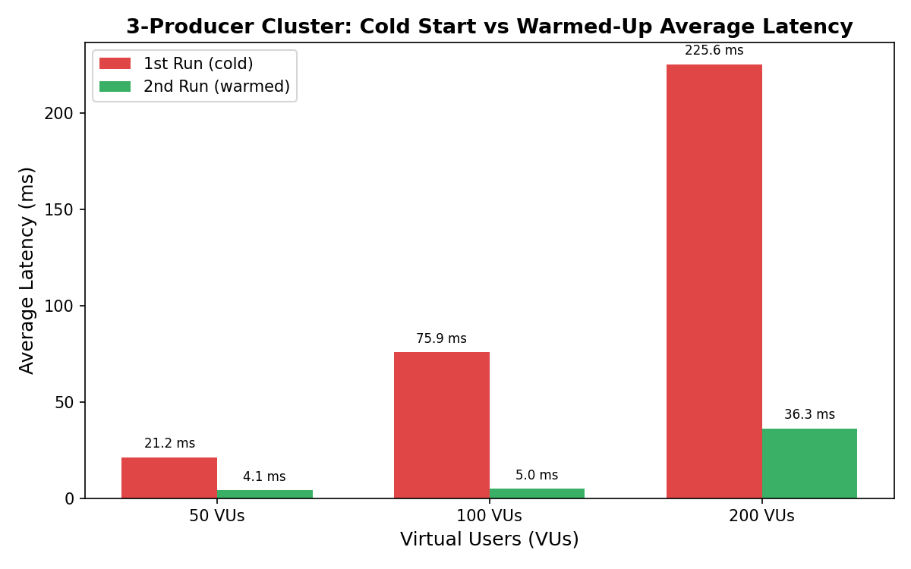
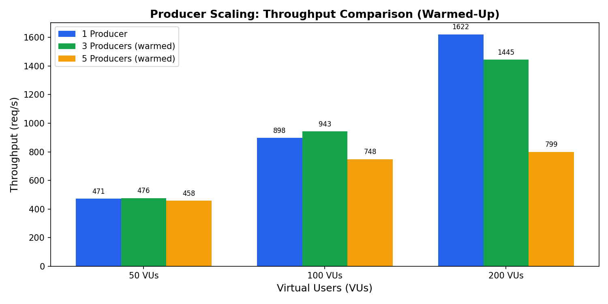
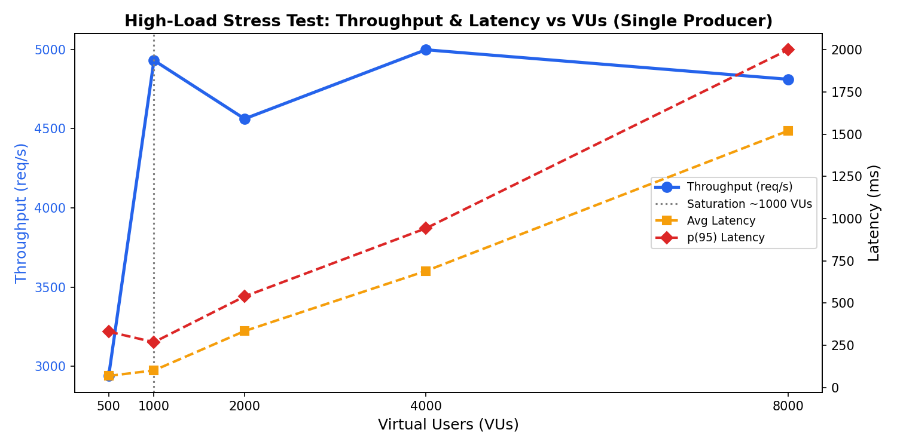
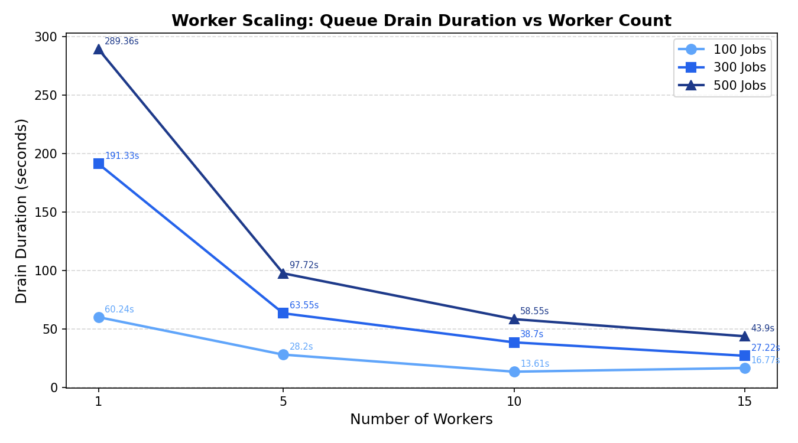
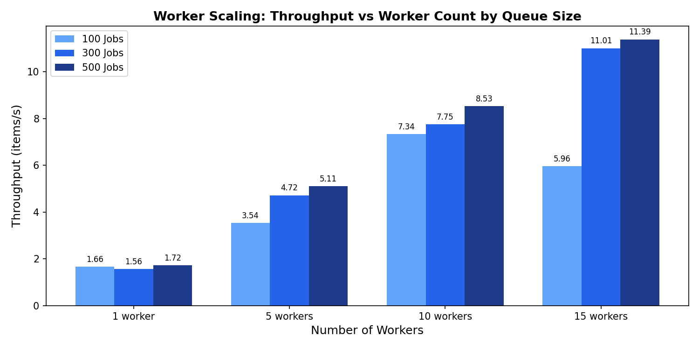

# Performance Test Report

This report presents the results of load and performance testing conducted on various configurations of the application. The application is decoupled in two main services:

1. Producer: An HTTP API that accepts payment requests. It can be run as a single instance or scaled horizontally behind an Nginx load balancer.   
2. Worker: A background job processor that drains a job queue (outbox pattern). It can be scaled by running multiple worker instances concurrently. 

Because of this 2-service architecture, the producers and workers can be scaled independently. The tests cover 2 dimensions: HTTP load testing of the producer API endpoint under varying loads (by varying virtual user counts in tests), and job-drainage into outstanding job completion throughput of the worker under varying job queue sizes. Both of these dimensions are tested for both single-instance application settings as well as varying numbers of producers/workers.

k6 is used for the API load tests by using varying numbers of virtual users across a duration of 60s to simulate requests. A batch processing script (using k6, PostgreSQL, bash) is used for the worker test to compute how fast all of the added jobs can be marked done in the outbox. More information on how to run the performance tests can be found within the `./service/perf/README.md` file.

During the producer tests, a single worker is set as a constant against the varying number of producers and vice versa to keep the environment from varying across tests. All tests achieved a 100% success rate with zero failed requests or failed payments across all tested configurations.

*It is to be noted that in the given scenario, the bottleneck is the external payment API call with varying delays from 10 ms to 2 seconds. The worker module directly interacts with this bottleneck point and therefore is the point of the system which can be improved by horizontal scaling and is the main focus of the horizontal scaling results in this report. However, scaling of producers is also shown in the tests below for the sake of discussion and this is further mentioned in section 1.3.*

## 1\. Producer Scaling Results (Single vs Multiple)

### 1.1 Single Instance (1 Producer)

The single instance producer performance across varying VUs is summarized below:

| VUs | Requests/s | Avg Latency | p(95) Latency | Max Latency |
| :---: | :---: | :---: | :---: | :---: |
| 50 | 471.4 | 5.17 ms | 8.27 ms | 501.44 ms |
| 100 | 897.8 | 10.53 ms | 41.01 ms | 757.83 ms |
| 200 | 1622.3 | 22.42 ms | 107.4 ms | 1.55 s |

The single instance scaled well from 50 to 200 VUs. Throughput roughly doubles with doubling of VUs but average latency also increases gradually.

### 1.2 Scaled Instance (3 Producers with nginx)

| VUs | Requests/s | Avg Latency | p(95) Latency |
| :---: | :---: | :---: | :---: |
| 50 (1st run) | 408.6 | 21.2 ms | 76.25 ms |
| 50 (2nd run) | 476.2 | 4.1 ms | 9.42 ms |
| 100 (1st run) | 561.6 | 75.93 ms | 272.79 ms |
| 100 (2nd run) | 943.4 | 5.0 ms | 13.95 ms |
| 200 (1st run) | 609.0 | 225.55 ms | 754.09 ms |
| 200 (2nd run) | 1445.4 | 36.26 ms | 107.86 ms |

Again, the configuration was tested against 50, 100 and 150 VUs across 60s. However, it is to be noted that two runs of the same test one-after-another were conducted at each VU level. This is because the first of each pair of runs showed elevated latency while the second run was more stable. The large gap between first and second runs suggests a cold-start or connection-pool saturation issue on initial load. Once warmed up, the 3-producer cluster delivers throughput comparable to the single instance, with lower average latency at 50 and100 VUs.

### 1.3 Scaled Instance (5 Producers with nginx)

| VUs | Requests/s | Avg Latency | p(95) Latency |
| :---: | :---: | :---: | :---: |
| 50 (1st run) | 348.8 | 41.88 ms | 135.55 ms |
| 50 (2nd run) | 458.1 | 8.07 ms | 27.86 ms |
| 100 (1st run) | 409.2 | 141.88 ms | 465.08 ms |
| 100 (2nd run) | 748.5 | 31.67 ms | 104.48 ms |
| 200 (1st run) | 371.0 | 434.93 ms | 1.36 s |
| 200 (2nd run) | 799.3 | 147.13 ms | 446.12 ms |

The 5-producers configuration performs worse than the 3-producers configuration even after warmup (for example the 2nd run with 200 VUs has an average requests/s of only 799.3 with 147.13 ms average latency). These results prove that the adding more producers introduces possible overhead with Nginx. But most importantly, it causes database connection pool contention, as the default number of open connections in PostgreSQL is 100, which is a bottleneck resource of the application. This overweighs any merit of adding more producers in our application compared to having a single producer instance, or at least limiting the scaling to 3 producers. Our main bottleneck latency is not being handled by the producer, therefore scaling of it is not required for better performance of the application. Rather, it is the worker that should be scaled up to improve the end-to-end latency of a job (from the time it is received from the client API to it being completed by the worker).

### 1.4 Stress Testing (Single Producer Instance)

Because of the above results, I limited further testing on a single producer and instead performed stress testing to note its saturation point.

| VUs | Requests/s | Avg Latency | p(90) Latency | p(95) Latency | Max Latency |
| :---: | :---: | :---: | :---: | :---: | :---: |
| 500 | 2940.2 | 68.0 ms | 171.4 ms | 330.1 ms | 4.28 s |
| 1000 | 4930.9 | 100.5 ms | 202.0 ms | 267.7 ms | 1.46 s |
| 2000 | 4562.1 | 333.6 ms | 461.8 ms | 538.6 ms | 1.65 s |
| 4000 | 4997.8 | 689.1 ms | 861.2 ms | 941.9 ms | 2.37 s |
| 8000 | 4811.4 | 1520.0 ms | 1870.0 ms | 2000.0 ms | 4.29 s |

The throughput peaks at around 4931-4997 requests/s between 1000 and 4000 VUs sending requests across 60s. Beyond 1000 VUs the system does not seem to improve throughput and becomes saturated. Latency increases with increase in VUs. At 8000 VUs the test logs showed that the active VU count had a minimum of 1982, meaning that about 6000 VUs had their request sent but were waiting in the TCP connection queue. This is likely the application’s connection limits causing the new requests to wait. Zero errors were observed at all load levels which is a good indicator that the system does not drop requests upon load increase.

## 2\. Worker Scaling Results (Single vs Multiple)

### 2.1 Single Instance (1 Worker)

The job drain duration performance of a single worker when 100, 300 and 500 jobs are added to the queue is shown below:

| Jobs | Drain Duration | Throughput | First Completion Time |
| :---: | :---: | :---: | :---: |
| 100 | 60.24 s | 1.66 items/s | 2.12 s |
| 300 | 191.33 s | 1.56 items/s | 3.16 s |
| 500 | 289.36 s | 1.72 items/s | 2.12 s |

A single worker is highly consistent at about 1.6 items/s for all queue sizes.

### 2.2 Scaled Instance (5 Workers)

The same configurations are tested again but while running 5 instances of workers simultaneously. 

| Jobs | Drain Duration | Throughput | First Completion Time |
| :---: | :---: | :---: | :---: |
| 100 | 28.20 s | 3.54 items/s | 9.42 s |
| 300 | 63.55 s | 4.72 items/s | 7.34 s |
| 500 | 97.72 s | 5.11 items/s | 9.39 s |

With 5 workers, throughput increases around 2-3 times over a single worker (instead of 5 times). This means that the average efficiency per worker drops, which may be due to contention on the outbox table by multiple worker instances.

### 2.3 Scaled Instance (10 Workers)

| Jobs | Drain Duration | Throughput | First Completion Time |
| :---: | :---: | :---: | :---: |
| 100 | 13.61 s | 7.34 items/s | 7.33 s |
| 300 | 38.70 s | 7.75 items/s | 9.42 s |
| 500 | 58.55 s | 8.35 items/s | 8.40 s |

The results show that 10 workers provide a noticeable improvement, reaching a throughput of 8.35 items/s at 500 queue size. Scaling efficiency improves as the queue size grows which may be due to workers staying busier and therefore reducing contention.

### 2.4 Scaled Instance (15 Workers)

| Jobs | Drain Duration | Throughput | First Completion Time |
| :---: | :---: | :---: | :---: |
| 100 | 16.77 s | 5.96 items/s | 8.39 s |
| 300 | 27.22 s | 11.01 items/s | 7.34 s |
| 500 | 43.90 s | 11.39 items/s | 9.42 s |

Out of all configurations, 15 workers achieve the highest throughput overall at 11.39 items/s for 500 queue size. It is to be noted that 15 workers have a lower throughput for 100 jobs than 10 worker instances. I believe this is caused by the overhead of coordinating 15 workers with lock contention over the outbox table rows. Below plots summarize the figures discussed in the above tables.  
   

Overall, the optimal worker count depends on the queue depth. For larger queues, it is obvious that a larger number of worker instances take less time to complete the jobs. But this exact number depends on the average queue depth, depending on the incoming client requests of the specific use case of this payment application.

## 3\. Observations, Bottlenecks and Optimizations

### 3.1 Producer-Specific Observations

* The single producer instance is the most consistent and highest-throughput configuration in this test environment. Horizontal scaling with 3 producers after warm-up gives similar results but using 5 producers degrades the performance. Database connection pool limits are likely the cause of the resource contention which causes this lessened performance. Pgbounce is already being used in the scaled application to optimize database connections.  
* A consistent warm-up was observed across all multi-producer runs. In the first run, the latency was much higher than the second run.  
* The producer API saturates at around 5000 requests/s. Beyond this point, additional VUs only increase latency rather than throughput.   
* It is highly recommended to use a single producer as higher loads do not break the API endpoint, rather the latency increases. The saturation point at around 5000 requests/s seems sufficient to cater to client responses.  
* It is also highly recommended to pre-warm database connection pools on start by establishing minimum connections before accepting real traffic to eliminate the first-run degradation in the performance.  
* Depending on the application, if the service requires a much higher number of requests/s on the API endpoint, an architecture with more instances of pgbounce could be considered, or a proper queue technology separate from the database could be suitable.

### 3.2 Worker-Specific Observations

* Single worker throughput is stable at about 1.6 items/s. However the working scaling is not exactly linear (15 workers achieve about 11x the single-worker throughput at 500 jobs instead of 15x). This is likely due to the application using database level locking on the outbox table.  
* The time to first completion is consistent and around 7-9 seconds regardless of worker instance number. This is likely a fixed startup delay because of the initial poll latency before the workers acquire any jobs to complete.   
* Because queue depths can vary, it is difficult to know the exact number of worker instances that are optimal. Auto-scaling worker count based on outstanding jobs in the outbox table is a possible improvement of the system design.